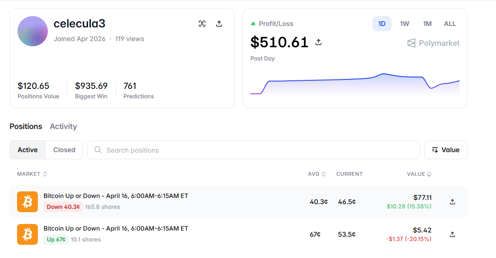

# Polymarket Arbitrage Trading Bot

Node.js / TypeScript trading automation for Polymarket crypto binary markets. The bot implements a hedged arbitrage approach: it buys both YES and NO when pricing allows, aiming to keep combined cost below parity while limiting directional exposure.

## Overview

The bot watches Polymarket short-horizon crypto markets (for example BTC/ETH/SOL “Up/Down” intervals), opens hedged legs according to configurable thresholds, persists state across restarts, and can work alongside separate redemption utilities for resolved positions.

---



---

https://github.com/user-attachments/assets/3e232356-f15a-42d6-969c-5a98aa922990

---

### Key features

- **Hedged arbitrage**: Coordinates YES and NO purchases to stay near risk-neutral.
- **Multi-market**: Concurrent handling of multiple market symbols.
- **Configurable entry**: Thresholds, reversal delta, and position caps.
- **State persistence**: On-disk state for recovery after restarts.
- **Redemption helpers**: Scripts for automatic or manual redemption flows.
- **Risk controls**: Sum-average guard, drawdown and balance checks.
- **Execution-oriented defaults**: Optional async posting, adaptive polling, debounced state writes.

## Architecture

### Technology stack

- **Runtime**: Node.js, TypeScript (strict)
- **Chain**: Polygon (EVM-compatible)
- **Execution**: Polymarket CLOB V2 via `@polymarket/clob-client-v2`
- **Market metadata**: Polymarket Gamma API (slugs, token IDs, condition IDs)
- **On-chain**: Ethers.js v6
- **Logging**: Structured logger with optional file output

### System flow

```
Market polling → Entry evaluation → Order placement → State update
Hedge completion → Redemption / PnL (optional workers)
```

## Installation

### Prerequisites

- Node.js 18+ and npm
- A Polygon wallet funded with USDC for trading
- A private key available to the process via environment (never commit it)

### Setup

1. **Clone the repository and enter the directory**

   ```bash
   git clone <repository-url>
   cd Polymarket-Arbitrage-Bot
   ```

2. **Install dependencies**

   ```bash
   npm install
   ```

3. **Configure environment**

   ```bash
   cp .env.example .env
   ```

   Edit `.env` with your settings. Example fragment:

   ```env
   PRIVATE_KEY=your_private_key_here
   TRADING_MARKETS=btc,eth,sol
   ENTRY_THRESHOLD=0.499
   REVERSAL_DELTA=0.020
   MAX_BUYS_PER_SIDE=4
   SHARES_PER_ORDER=5
   MAX_SUM_AVG=0.98
   ORDER_TICK_SIZE=0.01
   PRICE_BUFFER=0.03
   ASYNC_ORDER_EXECUTION=true
   POLL_INTERVAL_MS=200
   ADAPTIVE_POLLING=true
   MAX_DRAWDOWN_PERCENT=0
   MIN_BALANCE_USDC=2
   BOT_MIN_USDC_BALANCE=1
   WAIT_FOR_NEXT_MARKET_START=true
   CHAIN_ID=137
   CLOB_API_URL=https://clob.polymarket.com
   LOG_DIR=logs
   LOG_FILE_PREFIX=bot
   DEBUG=false
   ```

4. **Credentials**

   On first run the bot can derive or refresh API credentials from `PRIVATE_KEY`. Local credential storage is under `src/data/` (see project structure).

## Configuration

### Environment variables

| Variable | Type | Default | Description |
|----------|------|---------|-------------|
| `PRIVATE_KEY` | string | **required** | Trading wallet private key |
| `TRADING_MARKETS` | string | `btc` | Comma-separated market keys |
| `ENTRY_THRESHOLD` | number | `0.499` | Initial entry threshold |
| `REVERSAL_DELTA` | number | `0.020` | Reversal delta for buy logic |
| `MAX_BUYS_PER_SIDE` | number | `4` | Max buys per YES/NO side |
| `SHARES_PER_ORDER` | number | `5` | Shares per order |
| `MAX_SUM_AVG` | number | `0.98` | Max combined average cost guard |
| `ORDER_TICK_SIZE` | string | `0.01` | Tick size for pricing |
| `PRICE_BUFFER` | number | `0.03` | Price buffer |
| `ASYNC_ORDER_EXECUTION` | boolean | `true` | Post orders without blocking on confirmation |
| `POLL_INTERVAL_MS` | number | `200` | Base poll interval (ms) |
| `ADAPTIVE_POLLING` | boolean | `true` | Adjust polling under load |
| `MAX_DRAWDOWN_PERCENT` | number | `0` | Stop if drawdown exceeds % (`0` disables) |
| `MIN_BALANCE_USDC` | number | `2` | Minimum balance guard |
| `BOT_MIN_USDC_BALANCE` | number | `1` | Minimum balance to start |
| `CHAIN_ID` | number | `137` | Polygon mainnet |
| `DEBUG` | boolean | `false` | Verbose logging |

### Strategy parameters (summary)

- **Threshold**: Entry when either side is sufficiently cheap versus `ENTRY_THRESHOLD`.
- **Reversal delta**: Additional trigger based on rebound from a tracked low.
- **Max buys per side / shares**: Caps exposure per hedge cycle.
- **Max sum average**: Blocks trades that would push `avg(YES) + avg(NO)` above the limit.

## Usage

### Start the trading process

```bash
npm start
```

Equivalent:

```bash
npx ts-node src/index.ts
```

Typical startup sequence: credential setup, allowance checks, balance gates, optional wait for the next market window, then the main loop.

### Redemption worker

```bash
npx ts-node src/redeem-holdings.ts
npx ts-node src/redeem-holdings.ts --once
npx ts-node src/redeem-holdings.ts --dry-run
```

### Manual redemption utilities

```bash
npx ts-node src/auto-redeem.ts
npx ts-node src/auto-redeem.ts --check <conditionId>
npx ts-node src/auto-redeem.ts --api --max 500
```

### Balance logging

```bash
npm run balance:log
npx ts-node src/balance-logger.ts --once
```

## Technical details

### Trading strategy (high level)

1. **Entry**: After a completed hedge, the bot waits for a new setup; the first leg is chosen using threshold and market prices.
2. **Hedging**: Subsequent fills alternate sides to build a paired position.
3. **Triggers**: Combines depth-based, immediate second-side, and reversal-style triggers according to configuration.
4. **Profitability guard**: Enforces `sumAvg <= MAX_SUM_AVG` before accepting further risk.
5. **Completion**: When both sides reach `MAX_BUYS_PER_SIDE`, the hedge cycle resets.

### State

- **Persistent** (`src/data/copytrade-state.json`): Per-market quantities, costs, counts, and identifiers.
- **Ephemeral**: In-memory lows, active side tracking, and attempt counters (reset on process restart).

### Performance and safety

- Debounced persistence for high-frequency updates.
- Optional non-blocking order submission.
- Adaptive polling when the loop is idle versus active.
- Balance and allowance checks before trading.

## Project structure

```
Polymarket-Arbitrage-Bot/
├── public/
│   ├── arbitrage.png          # README / demo image
│   └── arbitrage.mp4          # README / demo video
├── src/
│   ├── index.ts
│   ├── auto-redeem.ts
│   ├── redeem.ts
│   ├── redeem-holdings.ts
│   ├── balance-logger.ts
│   ├── data/                  # Created as needed
│   │   ├── credential.json
│   │   ├── copytrade-state.json
│   │   └── token-holding.json
│   ├── order-builder/
│   │   ├── copytrade.ts
│   │   ├── gabagool.ts
│   │   ├── helpers.ts
│   │   └── types.ts
│   ├── config/
│   │   └── index.ts
│   ├── providers/
│   │   ├── clobclient.ts
│   │   ├── clobOrderAuth.ts
│   │   └── wssProvider.ts
│   ├── security/
│   │   ├── allowance.ts
│   │   └── createCredential.ts
│   └── utils/
│       ├── balance.ts
│       ├── holdings.ts
│       ├── redeem.ts
│       ├── logger.ts
│       └── console-file.ts
├── package.json
├── tsconfig.json
└── README.md
```

## API integration

### CLOB client

Orders are built and posted through `@polymarket/clob-client-v2` (CLOB V2 production: `https://clob.polymarket.com`):

```typescript
import { ClobClient, OrderType, Side } from "@polymarket/clob-client-v2";

const client = await getClobClient();
const response = await client.createAndPostOrder(
  userOrder,
  { tickSize, negRisk },
  OrderType.GTC
);
```

### Gamma API

Market payloads (outcomes, CLOB token IDs, condition ID) are loaded from Gamma, for example:

```typescript
const url = `https://gamma-api.polymarket.com/markets/slug/${slug}`;
const data = await response.json();
const { outcomes, clobTokenIds, conditionId } = data;
```

## Monitoring and logging

- Trade and state transitions, redemptions, errors, and periodic summaries.
- Typical log files:
  - `logs/bot-{date}.log` — consolidated console output
  - `logs/pnl.log` — append-only realized PnL
  - `logs/balance.log` — balance snapshots

Log levels include `success`, `info`, `warning`, `error`, and `debug` (when `DEBUG=true`).

## Change history

Notable maintenance items in this codebase:

1. **Sum-average guard**: Execution paths respect `MAX_SUM_AVG` so projected combined average does not exceed the configured ceiling.
2. **Typing**: Reduced unsafe casts in order and API handling where possible.
3. **Data directory**: Holdings and state writers ensure the data directory exists before persistence.
4. **Gamma responses**: Stronger typing for market fetch payloads.

For day-to-day changes, prefer `git log` and pull request descriptions.

## Risk considerations

1. **Market and liquidity**: Hedging mitigates directionality, not all risks; thin books increase partial fills and slippage.
2. **Execution**: Posted prices may not match realized fills during volatility.
3. **Fees and gas**: Polygon gas and any protocol costs affect net PnL.
4. **API limits**: Throttling or outages can delay or block actions.
5. **Time windows**: Short-interval markets resolve on a fixed schedule; timing errors are costly.
6. **Local state**: Disk state can be lost or corrupted; keep backups if you rely on continuity.

**Operational suggestions**: Start with small size, monitor `sumAvg` and logs, keep redundant USDC headroom, and validate redemption flows in dry-run where available.

## Development

```bash
npm run build
npm start
```

Smoke-style checks:

```bash
npx ts-node src/redeem-holdings.ts --dry-run
npx ts-node src/auto-redeem.ts --check <conditionId>
```


## Support

Use repository issues for bugs and feature requests. For API behavior, refer to Polymarket’s official CLOB and Gamma documentation.

---

**Disclaimer**: This software is provided as-is, without warranty. Prediction markets and digital assets involve substantial risk of loss. Use only capital you can afford to lose and comply with applicable laws in your jurisdiction.

**Version**: 2.3.1  
**Last updated**: April 2026
